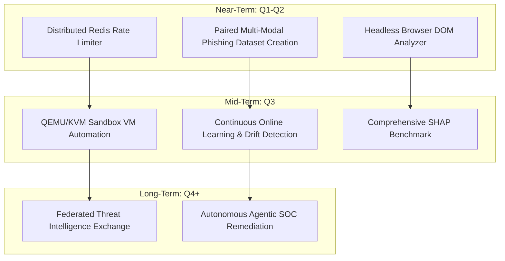

# PHISHGUARD Limitations & Future Work

## 1. Known Technical & Research Limitations

### 1.1 Dataset & Multi-Modal Evaluation Limitations
- **Single-Modality Ground Truth**: The primary benchmark dataset (`clean_urls.csv`) contains URL strings without paired raw email headers, captured HTML DOM trees, or file attachments. Evaluating multi-layer pipelines on pure URL datasets necessitates marking missing layers as `UNKNOWN`, which tests missing-layer resilience but cannot evaluate cross-layer detection recall on combined attacks.
- **Temporal & Distribution Drift**: Static URL datasets collected at fixed timestamps suffer from feature drift as adversaries adapt naming conventions and register novel top-level domains.

### 1.2 Architectural & Engineering Limitations
- **In-Memory Rate Limiting**: The current rate-limiting middleware maintains client IP counters in local process memory. In a distributed multi-worker deployment behind a load balancer, counters are not synchronized across nodes without a shared Redis store.
- **Dynamic Malware Sandbox**: The malware detonation engine currently provides interface boundaries and static analysis capabilities; automated VM snapshotting, execution isolation, and dynamic behavioral telemetry collection are not yet operational.
- **Synchronous Webpage Analysis**: Live DOM fetching is bounded by conservative timeouts and SSRF guards. Highly dynamic single-page applications (SPAs) that load credential forms via delayed JavaScript execution require headless browser rendering (e.g., Playwright/Puppeteer), which is not yet integrated into the static parser.

---

## 2. Future Research & Engineering Roadmap

### 2.1 Near-Term Priorities (Q1–Q2)
1. **Paired Multi-Modal Phishing Corpus**: Construct an open-source, curated evaluation dataset containing synchronized triples: $\langle \text{RFC 5322 Email}, \text{Resolved Webpage DOM}, \text{Delivered File Attachment} \rangle$.
2. **Distributed Infrastructure**: Replace in-memory rate limiting with Redis token-bucket middleware (`fastapi-limiter`).
3. **Headless Browser Crawler**: Integrate an isolated Chromium crawler to render client-side JavaScript forms, detect canvas fingerprinting, and capture dynamic phishing DOM mutations safely.

### 2.2 Mid-Term Priorities (Q3)
1. **Dynamic Sandbox Detonation VM**: Provision an isolated KVM hypervisor pipeline that deploys guest VMs, captures Sysmon/eBPF telemetry (processes, registry, sockets), and reverts snapshots post-analysis.
2. **Adversarial Hardening**: Retrain lexical models using adversarial training loops (incorporating homoglyphs, deep subdomains, and URL-encoded patterns).
3. **Automated Feature Ablation**: Execute Experiment 4 across all 641k samples to isolate the minimal optimal feature vector.

### 2.3 Long-Term Horizons (Q4+)
1. **Federated Threat Intelligence**: Establish STIX/TAXII integrations for automated, privacy-preserving IOC exchange.
2. **Autonomous Incident Response**: Integrate with SIEM/SOAR platforms (Splunk, Microsoft Sentinel) to trigger automated firewall block rules upon CRITICAL multi-layer classifications.
