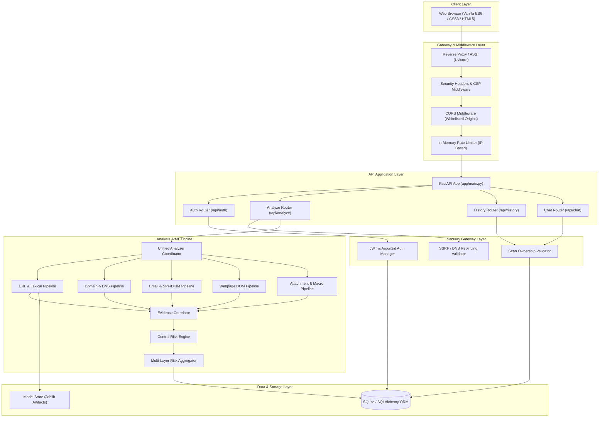

# PHISHGUARD System Architecture

## 1. Architectural Overview

PHISHGUARD implements a layered, modular cybersecurity platform designed for high throughput, defense-in-depth threat analysis, and secure multi-tenant operation.

---

## 2. Core Subsystems & Implementation Status

| Subsystem | Primary Responsibilities | Status |
| :--- | :--- | :--- |
| **Gateway & Security** | Request filtering, rate-limiting, CORS, CSP injection, SSRF & DNS rebinding checks. | `[IMPLEMENTED]` |
| **Authentication & AuthZ** | Argon2id password hashing, JWT HS256 access tokens, ownership validation. | `[IMPLEMENTED]` |
| **Feature Extraction** | Lexical URL analysis, header decoding, DOM parsing, OLE macro extraction. | `[IMPLEMENTED]` |
| **Machine Learning Inference** | 14-feature lexical classification with random forest fallback. | `[IMPLEMENTED]` |
| **Risk & Correlation Engine** | Multi-signal weighting, clamp $[0, 100]$, level calculation (LOW to CRITICAL). | `[IMPLEMENTED]` |
| **Multi-Layer Aggregator** | Non-intrusive evidence assembly preserving caller risk posture. | `[IMPLEMENTED]` |
| **AI Security Analyst** | Context-bounded natural language debriefs with deterministic fallback. | `[IMPLEMENTED]` |
| **Database Layer** | SQLite persistence with SQLAlchemy 2.0 ORM schemas for users and scans. | `[IMPLEMENTED]` |
| **Malware Sandbox VM** | Hypervisor-isolated dynamic malware detonation and telemetry logging. | `[PLANNED]` |

---

## 3. Data Flow

1. **User Request**: Client initiates an analysis request (`POST /api/analyze/url`, `POST /api/analyze/email`, `POST /api/analyze/attachment`, or `POST /api/analyze/unified`) authenticated with a Bearer JWT.
2. **Security Pre-Flight**:
   - Rate limit verified.
   - For URL targets: Hostname resolved to IP; checked against private, loopback, link-local, and cloud metadata addresses (`169.254.169.254`).
   - For File uploads: File size validated ($\le 10\text{ MB}$), MIME type verified, stored in isolated temporary path with sanitized filename.
3. **Artifact Analysis**: Artifact routed to corresponding feature extractors.
4. **Correlation & Risk Evaluation**: Evidence correlator detects cross-vector anomalies; risk engine aggregates additive weighted signals.
5. **Aggregation & Persistence**: Multi-layer risk aggregator builds standard output; scan result saved to database linked to `user_id`.
6. **Response Delivery**: Sanitized JSON returned to client and rendered in SaaS dashboard.
