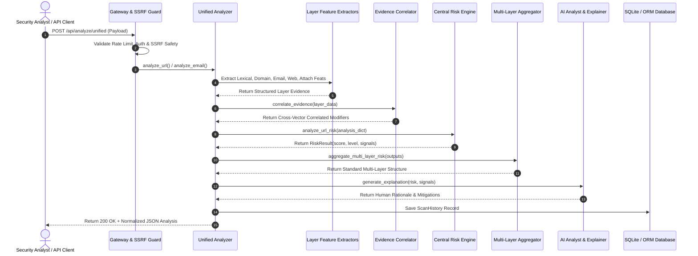

# PHISHGUARD Threat Analysis Pipeline

## 1. End-to-End Processing Stages

The PHISHGUARD threat analysis engine processes multi-vector indicators through eight deterministic stages:

---

## 2. Stage Breakdown & Logic

### Stage 1: Ingestion & Pre-Flight Validation `[IMPLEMENTED]`
- Validate bearer token and extract `user_id`.
- Enforce IP-based rate limiting.
- Validate target URL against private/loopback/cloud metadata IP addresses via DNS pre-resolution.

### Stage 2: Parallel Artifact Extraction `[IMPLEMENTED]`
- **Lexical URL**: Computes 14-dimensional feature vector; evaluates `predict_url()` via frozen model.
- **Domain & DNS**: Resolves hostnames, parses TLDs, calculates subdomain depth.
- **Brand Intelligence**: Scans for known target keywords and flags discrepancies between registrable domain and brand keywords.
- **Redirects**: Traverses HTTP redirect chain up to 5 hops with SSRF checks on every intermediate destination.
- **Webpage DOM**: Parses HTML for password inputs, external form action endpoints, and overlay iframes.
- **Email Authentication**: Inspects SPF, DKIM, DMARC headers; flags display-name spoofing.
- **Email NLP**: Scores urgency and social engineering keywords.
- **Static Attachment**: Verifies MIME types via magic bytes; scans OLE streams for VBA macros; parses PE sections.
- **Reputation**: Queries local cache or VirusTotal API v3.

### Stage 3: Evidence Correlation `[IMPLEMENTED]`
- The Evidence Correlator (`src/analysis/evidence_correlator.py`) tests for compound cross-layer anomalies:
  - *Example*: Brand keyword detected in URL + Domain is not official brand domain + Webpage contains password input $\rightarrow$ Elevates correlated phishing confidence by $+35.0$ risk weight.

### Stage 4: Central Risk Scoring `[IMPLEMENTED]`
- Collects all signals from Feature Extractors and Correlator.
- Computes raw score:
  $$\text{Score}_{\text{raw}} = \sum_{i=1}^{M} w_i$$
- Clamps score into range $[0.0, 100.0]$.
- Maps score to risk level:
  - $\text{Score} < 25.0 \implies \mathbf{LOW}$
  - $25.0 \le \text{Score} < 50.0 \implies \mathbf{MEDIUM}$
  - $50.0 \le \text{Score} < 75.0 \implies \mathbf{HIGH}$
  - $\text{Score} \ge 75.0 \implies \mathbf{CRITICAL}$

### Stage 5: Multi-Layer Aggregation `[IMPLEMENTED]`
- Standardizes output schema under `multi_layer_risk` key.
- Explicitly sets unqueried or absent layers to `None` / `UNKNOWN`.
- Does **not** recalculate scores or mutate caller risk determinations.

### Stage 6: Explainable Rationale Generation `[IMPLEMENTED]`
- Converts active risk signals and correlated evidence into structured markdown bullets for analysts.

### Stage 7: Telemetry Persistence `[IMPLEMENTED]`
- Creates an entry in `scan_history` associated with `user_id`.
- Stores raw analysis JSON, computed risk score, target, and timestamp.

### Stage 8: AI Analyst Interaction `[IMPLEMENTED]`
- Security analysts can debrief with the AI Security Analyst (`POST /api/chat`) referencing `scan_id` for automated triage, executive summaries, or firewall rule generation.
