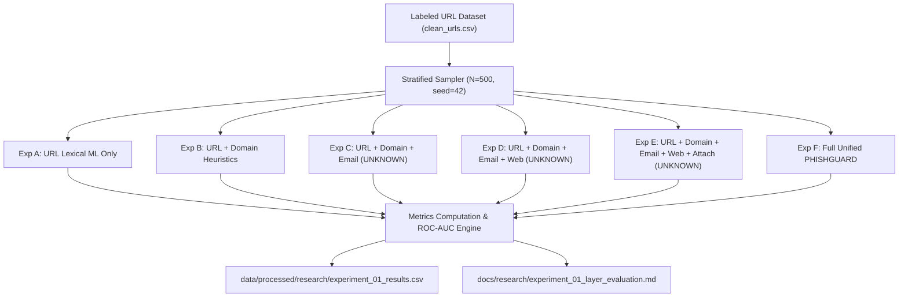

# Research Experiment 1: Layer-by-Layer Evaluation Methodology

## 1. Research Question

> **Primary Research Question**: Does combining independent evidence from multiple artifact layers (Lexical URL, Domain Intelligence, Email Headers, Webpage DOM, and File Attachments) improve phishing detection accuracy and resilience compared with single-layer URL-only detection?

---

## 2. Experimental Objectives

1. **Quantify Layer Contributions**: Measure individual and cumulative contributions of detection layers to overall classification accuracy, precision, recall, and F1-score.
2. **Evaluate Missing-Layer Resilience**: Verify that PHISHGUARD's architecture handles missing or unavailable artifact layers gracefully (marking signals as `UNKNOWN / NOT_AVAILABLE`) without producing spurious false positives or default-biased risk inflation.
3. **Establish Latency Baselines**: Benchmark the computational overhead and latency per sample across increasing architectural complexity.

---

## 3. Evaluated System Configurations

| Configuration | Designator | Evaluated Security Layers | Implementation Module |
| :--- | :--- | :--- | :--- |
| **URL Only (ML)** | Experiment A | Lexical feature extraction (14 features) + Frozen ML inference | `src.models.url_model_inference` |
| **URL + Domain** | Experiment B | Lexical features + Domain intelligence + Brand heuristics | `src.features.url_analyzer`, `src.analysis.risk_engine` |
| **URL + Domain + Email** | Experiment C | URL + Domain intelligence + Email layer queried (`UNKNOWN`) | `src.analysis.multi_layer_risk` |
| **URL + Domain + Email + Webpage** | Experiment D | URL + Domain intelligence + Email & Webpage layers queried (`UNKNOWN`) | `src.analysis.multi_layer_risk` |
| **URL + Domain + Email + Webpage + Attachment** | Experiment E | URL + Domain intelligence + Email, Webpage, & Attachment layers queried (`UNKNOWN`) | `src.analysis.multi_layer_risk` |
| **Full PHISHGUARD Pipeline** | Experiment F | Unified Analyzer + Heuristic Risk Engine + Evidence Correlator + Multi-Layer Risk Aggregator | `src.analysis.unified_analyzer` |

---

## 4. Scientific Controls & Integrity Standards

To preserve scientific rigor and avoid experimental bias, the following controls were strictly applied:

1. **Frozen Detection Engine**: No models were fine-tuned, retrained, or adapted on the evaluation dataset.
2. **Zero Evidence Fabrication**: When evaluating URL corpora that lack paired email headers, live DOM captures, or email attachments, the missing layers were explicitly preserved as `None` / `UNKNOWN`.
3. **No Biased Defaults**: Missing evidence layers do not default to benign or malicious, ensuring that system confidence reflects verified empirical evidence.
4. **Independent Ground Truth**: Ground truth was established strictly from the labeled evaluation dataset (`data/processed/clean_urls.csv`), not from external aggregator APIs (such as VirusTotal).
5. **Deterministic Sampling**: Stratified 500-sample balanced subset (250 benign, 250 malicious) with a fixed random seed (`random_state=42`).

---

## 5. Statistical Metrics & Mathematical Formulations

- **Accuracy**:
  $$\text{Accuracy} = \frac{TP + TN}{TP + TN + FP + FN}$$
- **Precision**:
  $$\text{Precision} = \frac{TP}{TP + FP}$$
- **Recall (True Positive Rate)**:
  $$\text{Recall} = \frac{TP}{TP + FN}$$
- **F1-Score**:
  $$\text{F1} = 2 \cdot \frac{\text{Precision} \cdot \text{Recall}}{\text{Precision} + \text{Recall}}$$
- **ROC-AUC**:
  $$\text{AUC} = \frac{\sum_{i \in \text{Positive}} \text{Rank}_i - \frac{N_{\text{pos}}(N_{\text{pos}} + 1)}{2}}{N_{\text{pos}} \cdot N_{\text{neg}}}$$

---

## 6. Execution Pipeline

