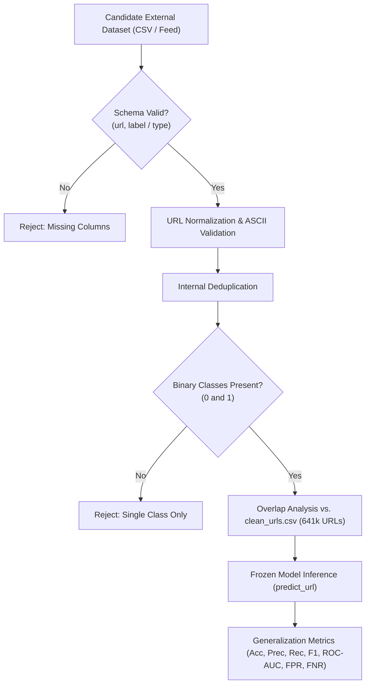

# Research Experiment 2: External Generalization Evaluation Methodology

## 1. Research Question & Hypothesis

> **Primary Research Question**: How well does the PHISHGUARD URL detection model generalize to an independent dataset that was not used for model development or internal evaluation?

- **Hypothesis**: The frozen URL classification model will retain useful predictive capability on an independent dataset, but performance may shift due to distribution divergence in URL lengths, brand keywords, top-level domains (TLDs), attack campaigns, and labeling criteria.

---

## 2. Experimental Motivation

Supervised machine learning models evaluated solely on held-out splits (e.g. 80/20 train/test) from a single collection source often exhibit optimistic accuracy due to shared collection biases, identical domain distributions, and static temporal windows (in-distribution evaluation).

Evaluating model weights against an independently collected, uncurated external dataset is essential to:
1. Measure out-of-distribution (OOD) generalization degradation.
2. Determine whether lexical features overfit to specific URL patterns present in the development corpus.
3. Quantify false-positive rate (FPR) and false-negative rate (FNR) shifts in enterprise operational contexts.

---

## 3. Frozen Baseline Model Specification

The evaluation protocol mandates that the baseline model remains strictly frozen without any fine-tuning, threshold tuning, or hyperparameter changes.

| Attribute | Specification |
| :--- | :--- |
| **Model Algorithm** | Random Forest Classifier (`RandomForestClassifier`) |
| **Ensemble Size** | $n\_estimators = 200$ |
| **Class Weighting** | `balanced` |
| **Random Seed** | `random_state = 42` |
| **Splitting Strategy** | 80% Training ($N = 512,886$), 20% Testing ($N = 128,222$), Stratified |
| **Inference Threshold** | $P(\text{Malicious}) \ge 0.50$ |
| **Feature Extraction** | Exactly 14 lexical features extracted by `extract_url_features()` |
| **Internal Benchmark Results** | **Accuracy**: $91.08\%$ \| **Precision**: $85.17\%$ \| **Recall**: $88.59\%$ \| **F1**: $86.85\%$ |

---

## 4. 14-Feature Lexical Compatibility Vector

The external evaluation harness extracts the exact same 14 features in unchanged sequence:

1. `url_length`
2. `hostname_length`
3. `path_length`
4. `query_length`
5. `dot_count`
6. `hyphen_count`
7. `digit_count`
8. `special_char_count`
9. `subdomain_count`
10. `contains_ip`
11. `uses_https`
12. `contains_at`
13. `contains_double_slash`
14. `suspicious_keyword_count`

---

## 5. External Dataset Requirements & Ingestion Protocol

To ensure true independence, the external dataset must satisfy the following criteria:

### 5.1 Required External Dataset Characteristics
- **Independence**: Sourced from an independent collection platform (e.g., PhishTank, OpenPhish, APWG, or Tranco Top 1M legitimate domains).
- **Columns**: `url` (string) and `label` (binary integer $0 = \text{benign}, 1 = \text{malicious}$).
- **Quality**: Non-empty URLs, valid HTTP/HTTPS or hostnames, valid binary labels.
- **Overlap Threshold**: Exact overlaps with the development set are quantified and reported.

---

## 6. Statistical Metrics & Mathematical Formulations

- **Accuracy**: $\frac{TP + TN}{TP + TN + FP + FN}$
- **Precision**: $\frac{TP}{TP + FP}$
- **Recall (TPR)**: $\frac{TP}{TP + FN}$
- **F1-Score**: $2 \cdot \frac{\text{Precision} \cdot \text{Recall}}{\text{Precision} + \text{Recall}}$
- **False Positive Rate (FPR)**: $\frac{FP}{FP + TN}$
- **False Negative Rate (FNR)**: $\frac{FN}{FN + TP}$
- **Generalization Delta**: $\Delta \text{Metric} = \text{Metric}_{\text{external}} - \text{Metric}_{\text{internal\_benchmark}}$

---

## 7. Current Execution Status

> **STATUS: BLOCKED — INDEPENDENT EXTERNAL DATASET REQUIRED**
> 
> *Reason*: The repository contains only Dataset 1 (`clean_urls.csv`, `url_features.csv`, `malicious_phish.csv`), which constitutes the development and internal test corpus. No secondary, independent URL dataset is currently stored on disk. Synthetic test samples (`test_email.eml`, `test_attachment.docm`) cannot be used as external URL benchmarks.
>
> The complete evaluation harness (`src/research/experiment_02_external_evaluation.py`) is fully implemented, verified with unit tests, and ready to ingest an external CSV upon provisioning.
