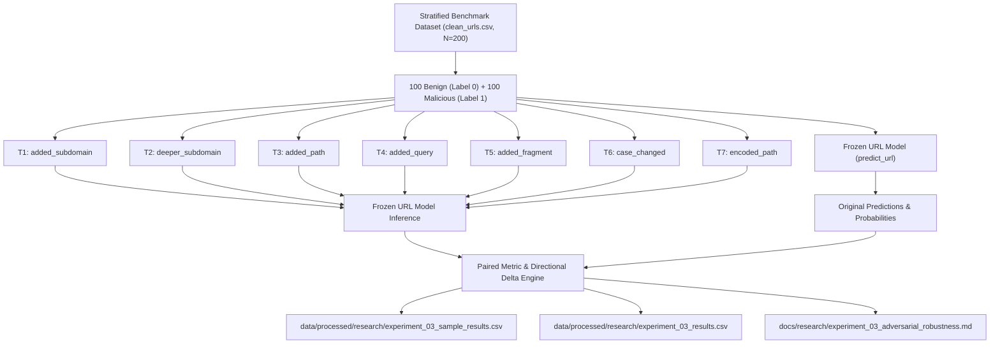

# Research Experiment 3: Adversarial URL Robustness Methodology

## 1. Research Question & Hypothesis

> **Primary Research Question**: How robust is the PHISHGUARD URL detection model to adversarial URL transformations that preserve the underlying destination or semantic intent?

- **Hypothesis**: The frozen lexical URL model will be sensitive to some transformations because its prediction depends on structural and lexical URL features (e.g. path lengths, subdomain counts, suspicious keywords).

---

## 2. Experimental Design: Paired Adversarial Evaluation

The experiment implements a controlled paired evaluation protocol:

Every original sample $s_i = \langle \text{url}_i, y_i \rangle$ generates 7 paired transformed evaluations $s_{i, t} = \langle \text{url}_{i, t}, \hat{y}_{i, t}, P_{i, t} \rangle$, resulting in $200 \times 7 = 1,400$ paired evaluations with explicit bidirectional tracking.

---

## 3. Transformation Definitions & Validity Rules

| ID | Transformation Name | Transformation Logic | Threat Actor / Evasion Intent |
| :---: | :--- | :--- | :--- |
| **T1** | `added_subdomain` | Prepends single subdomain level (`auth.`) to hostname. | Mimic legitimate subdomains; increase subdomain count. |
| **T2** | `deeper_subdomain` | Prepends two subdomain levels (`portal.secure.`). | Evade single-subdomain lexical checks. |
| **T3** | `added_path` | Appends `/verify/account` to path component. | Force trigger keyword detection or pad path length. |
| **T4** | `added_query` | Appends `?session_id=987654321&auth=true`. | Append tracking parameters to confuse URL parsers. |
| **T5** | `added_fragment` | Appends `#security-notice`. | Client-side fragment evasion (unseen by HTTP server). |
| **T6** | `case_changed` | Converts scheme to uppercase and capitalizes path. | Test case-sensitivity of keyword and token extractors. |
| **T7** | `encoded_path` | Replaces path characters with percent-encoding (`%2E`, `%2D`). | Obfuscate path keywords from naive substring matchers. |

### Validity & Determinism Rules
1. **Strict Offline Execution**: Zero network sockets, zero DNS resolutions, and zero HTTP calls are made.
2. **Determinism**: Transformations use pure string operations without unseeded randomness.
3. **Traceability**: Every output row references the immutable original `sample_id`.

---

## 4. Primary Metrics & Mathematical Formulations

- **Overall Flip Rate**:
  $$\text{Flip Rate} = \frac{\sum_{i=1}^{N} \mathbb{I}(\hat{y}_{i, \text{orig}} \neq \hat{y}_{i, \text{trans}})}{N}$$
- **Malicious Evasion Rate**:
  $$\text{Evasion Rate} = \frac{\sum_{i \in \text{Malicious Correct}} \mathbb{I}(\hat{y}_{i, \text{trans}} = 0)}{\sum_{i \in \text{Malicious Correct}} 1}$$
- **Benign False-Alarm Rate**:
  $$\text{False-Alarm Rate} = \frac{\sum_{i \in \text{Benign Correct}} \mathbb{I}(\hat{y}_{i, \text{trans}} = 1)}{\sum_{i \in \text{Benign Correct}} 1}$$
- **Mean Probability Shift**:
  $$\Delta \bar{P} = \frac{1}{N} \sum_{i=1}^{N} (P_{i, \text{trans}} - P_{i, \text{orig}})$$
